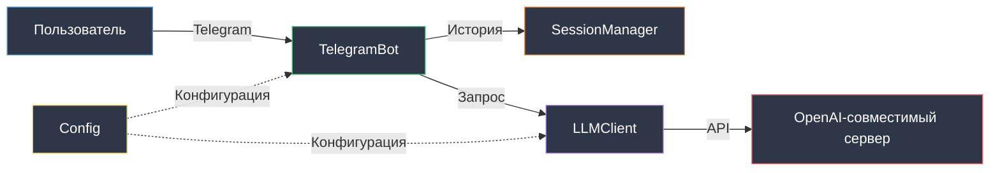

# Архитектура

Обзор архитектуры AI Dialogs Bot.

## Обзор системы

AI Dialogs Bot - Telegram бот с ролевым AI-ассистентом на базе OpenAI-совместимого API.



## Компоненты

### Config
Управление конфигурацией через pydantic-settings.

```python
class Config(BaseSettings):
    telegram_bot_token: str
    llm_base_url: str
    llm_model: str
    system_prompt_file: str
```

**Ответственность:**
- Загрузка переменных из `.env`
- Валидация обязательных полей
- Предоставление конфигурации другим компонентам

### TelegramBot
Обработка Telegram событий и команд.

**Ответственность:**
- Регистрация обработчиков команд
- Обработка сообщений пользователей
- Взаимодействие с SessionManager и LLMClient
- Отправка ответов пользователю

**Команды:**
- `/start` - приветствие, очистка истории
- `/reset` - очистка истории диалога
- `/role` - отображение системного промпта

### SessionManager
Управление историей диалогов пользователей.

**Ответственность:**
- Хранение сессий в памяти: `dict[int, list[dict]]`
- Добавление сообщений в историю
- Получение истории для пользователя
- Очистка истории

**Ограничения:**
- Данные только в памяти
- История теряется при перезапуске
- Нет персистентности (MVP)

### LLMClient
Взаимодействие с OpenAI-совместимым API.

**Ответственность:**
- Чтение системного промпта из файла
- Формирование запросов к API
- Обработка ответов
- Обработка ошибок API

## Поток данных

```mermaid
sequenceDiagram
    participant U as Пользователь
    participant B as TelegramBot
    participant SM as SessionManager
    participant L as LLMClient
    participant API as OpenAI API

    U->>B: Отправляет сообщение
    B->>SM: add_message(user_id, "user", text)
    B->>SM: get_session(user_id)
    SM-->>B: История сообщений
    B->>L: get_response(messages)
    L->>L: Добавляет system prompt
    L->>API: POST /chat/completions
    API-->>L: Ответ
    L-->>B: Текст ответа
    B->>SM: add_message(user_id, "assistant", response)
    B->>U: Отправляет ответ

    style U fill:#2d3748,stroke:#4299e1,color:#ffffff
    style B fill:#2d3748,stroke:#48bb78,color:#ffffff
    style SM fill:#2d3748,stroke:#ed8936,color:#ffffff
    style L fill:#2d3748,stroke:#9f7aea,color:#ffffff
    style API fill:#2d3748,stroke:#f56565,color:#ffffff
```

## Принципы проектирования

### KISS (Keep It Simple, Stupid)
Максимальная простота реализации без избыточных абстракций.

### MVP подход
Только необходимый функционал, без избыточности.

### SOLID

**Single Responsibility Principle:**
- `Config` - только конфигурация
- `SessionManager` - только управление сессиями
- `LLMClient` - только работа с API
- `TelegramBot` - только обработка событий

**Dependency Inversion:**
- Зависимости передаются через конструктор
- Простая подмена для тестирования

### Линейность кода
Прямые зависимости, без сложных цепочек вызовов.

## Структура директорий

```
src/
├── main.py              # Точка входа
├── config.py            # Config класс
├── bot.py               # TelegramBot класс
├── llm_client.py        # LLMClient класс
└── session_manager.py   # SessionManager класс

tests/
├── test_config.py
├── test_bot.py
├── test_llm_client.py
├── test_session_manager.py
└── test_integration.py

prompts/
└── system_prompt.txt    # Роль ИИ-ассистента
```

**Принцип: 1 класс = 1 файл**

## Технологии

**Основные:**
- Python 3.11+ (современный синтаксис типов)
- aiogram 3.x (Telegram Bot API, polling)
- openai (клиент для LLM)
- pydantic-settings (управление конфигурацией)
- uv (управление зависимостями)

**Качество:**
- ruff (линтер + форматтер)
- mypy (проверка типов)
- pytest (тестирование)
- pytest-cov (покрытие)

## Логирование

Встроенный `logging` модуль:
- Вывод в консоль
- Запись в `bot.log`

**Логируются:**
- Старт/стоп бота
- Входящие команды и сообщения
- Вызовы LLM API
- Ошибки с контекстом

## Обработка ошибок

```python
try:
    response = self.llm_client.get_response(messages)
except Exception as e:
    logger.error(f"Ошибка: {e}")
    await message.answer("Извините, произошла ошибка")
```

**Принципы:**
- Логирование с контекстом
- Понятные сообщения пользователю
- Не глотать исключения

## Следующие шаги

- [Модель данных](data-model.md) - детали хранения данных
- [Интеграции](integrations.md) - работа с внешними API
- [Codebase Tour](codebase-tour.md) - обзор кода


