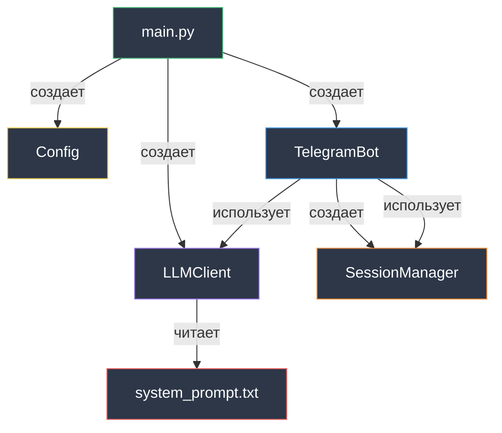

# Codebase Tour

Детальный обзор кодовой базы AI Dialogs Bot.

## Структура проекта

```
aidialogs/
├── src/                 # Исходный код
├── tests/               # Тесты
├── prompts/             # Системные промпты
├── docs/                # Документация
├── .env                 # Конфигурация (не в git)
├── Makefile             # Команды автоматизации
├── pyproject.toml       # Зависимости и настройки
└── pytest.ini           # Настройки pytest
```

## Принцип: 1 класс = 1 файл

Каждый класс в отдельном файле для простоты навигации.

## src/main.py

**Назначение:** Точка входа приложения.

```python
async def main():
    config = Config()
    llm_client = LLMClient(
        base_url=config.llm_base_url,
        model=config.llm_model,
        system_prompt_file=config.system_prompt_file,
    )
    bot = TelegramBot(
        config.telegram_bot_token, 
        llm_client, 
        config.system_prompt_file
    )

    logger.info("Бот запущен")
    try:
        await bot.start()
    except KeyboardInterrupt:
        logger.info("Бот остановлен")
```

**Поток инициализации:**
1. Создание `Config` → загрузка `.env`
2. Создание `LLMClient` → чтение системного промпта
3. Создание `TelegramBot` → регистрация обработчиков
4. Запуск polling

**Обработка ошибок:**
- `KeyboardInterrupt` → корректное завершение
- `Exception` → логирование и прокидывание

## src/config.py

**Назначение:** Управление конфигурацией.

```python
class Config(BaseSettings):
    telegram_bot_token: str
    llm_base_url: str
    llm_model: str
    system_prompt_file: str = "prompts/system_prompt.txt"

    model_config = SettingsConfigDict(
        env_file=".env", 
        env_file_encoding="utf-8"
    )
```

**Ключевые моменты:**
- Наследуется от `BaseSettings` (pydantic-settings)
- Автоматическая валидация типов
- Загрузка из `.env` файла
- Дефолтное значение для `system_prompt_file`

**Валидация:**
- Обязательные поля: `telegram_bot_token`, `llm_base_url`, `llm_model`
- Если поле отсутствует → `ValidationError`

## src/session_manager.py

**Назначение:** Управление историей диалогов.

```python
class SessionManager:
    def __init__(self):
        self._sessions: dict[int, list[dict]] = {}

    def get_session(self, user_id: int) -> list[dict]:
        if user_id not in self._sessions:
            self._sessions[user_id] = []
        return self._sessions[user_id]

    def add_message(self, user_id: int, role: str, content: str):
        session = self.get_session(user_id)
        session.append({"role": role, "content": content})

    def clear_session(self, user_id: int):
        self._sessions[user_id] = []
```

**Ключевые моменты:**
- Приватное поле `_sessions` для инкапсуляции
- Автоматическое создание сессии при первом обращении
- Возврат ссылки на список (не копии)
- Типизация везде: `dict[int, list[dict]]`

**Паттерны:**
- Ленивая инициализация сессий
- Прямая работа с dict без абстракций

## src/llm_client.py

**Назначение:** Взаимодействие с LLM API.

```python
class LLMClient:
    def __init__(self, base_url: str, model: str, system_prompt_file: str):
        self.client = OpenAI(base_url=base_url, api_key="not-needed")
        self.model = model
        self.system_prompt = self._read_prompt_file(system_prompt_file)

    def _read_prompt_file(self, file_path: str) -> str:
        try:
            with open(file_path, "r", encoding="utf-8") as f:
                return f.read().strip()
        except FileNotFoundError:
            logger.error(f"Файл промпта не найден: {file_path}")
            raise

    def get_response(self, messages: list[dict]) -> str:
        full_messages = [
            {"role": "system", "content": self.system_prompt}
        ] + messages

        try:
            response = self.client.chat.completions.create(
                model=self.model, 
                messages=full_messages
            )
            content = response.choices[0].message.content
            return content if content is not None else ""
        except Exception as e:
            logger.error(f"Ошибка LLM API: {e}")
            raise
```

**Ключевые моменты:**
- Чтение промпта один раз при инициализации
- Кэширование промпта в `self.system_prompt`
- Добавление system prompt в каждый запрос
- Обработка `None` в ответе (безопасность типов)

**Паттерны:**
- Приватный метод `_read_prompt_file` для чтения файла
- Раннее выбрасывание исключений (fail fast)
- Явная обработка ошибок с логированием

## src/bot.py

**Назначение:** Обработка Telegram событий.

```python
class TelegramBot:
    def __init__(self, token: str, llm_client: LLMClient, 
                 system_prompt_file: str):
        self.bot = Bot(token=token)
        self.dp = Dispatcher()
        self.llm_client = llm_client
        self.session_manager = SessionManager()
        self.system_prompt_file = system_prompt_file
        self._register_handlers()
```

**Инициализация:**
- Создание `Bot` и `Dispatcher` (aiogram)
- Внедрение зависимости `LLMClient`
- Создание собственного `SessionManager`
- Регистрация обработчиков

### Регистрация обработчиков

```python
def _register_handlers(self):
    self.dp.message.register(self._start_handler, Command("start"))
    self.dp.message.register(self._reset_handler, Command("reset"))
    self.dp.message.register(self._role_handler, Command("role"))
    self.dp.message.register(self._message_handler)
```

**Порядок важен:** команды регистрируются первыми, затем общий обработчик.

### Обработчик /start

```python
async def _start_handler(self, message: Message):
    if not message.from_user:
        return
    user_id = message.from_user.id
    logger.info(f"Команда /start от пользователя {user_id}")
    self.session_manager.clear_session(user_id)
    await message.answer("Привет! Я AI-ассистент. Задай мне любой вопрос.")
```

**Действия:**
1. Проверка наличия `from_user`
2. Логирование команды
3. Очистка истории
4. Отправка приветствия

### Обработчик /reset

```python
async def _reset_handler(self, message: Message):
    if not message.from_user:
        return
    user_id = message.from_user.id
    logger.info(f"Команда /reset от пользователя {user_id}")
    self.session_manager.clear_session(user_id)
    await message.answer("История диалога очищена. Начнём сначала!")
```

**Идентичен /start**, но другое сообщение.

### Обработчик /role

```python
async def _role_handler(self, message: Message):
    if not message.from_user:
        return
    user_id = message.from_user.id
    logger.info(f"Команда /role от пользователя {user_id}")
    await message.answer(self.llm_client.system_prompt)
```

**Отображает системный промпт** из кэша `LLMClient`.

### Обработчик сообщений

```python
async def _message_handler(self, message: Message):
    if not message.text or not message.from_user:
        return

    user_id = message.from_user.id
    logger.info(f"Сообщение от пользователя {user_id}: {message.text}")

    # Сохранение сообщения пользователя
    self.session_manager.add_message(user_id, "user", message.text)

    try:
        # Получение ответа от LLM
        logger.info(f"Отправка запроса в LLM для пользователя {user_id}")
        response = self.llm_client.get_response(
            self.session_manager.get_session(user_id)
        )
        logger.info(f"Получен ответ от LLM для пользователя {user_id}")

        # Сохранение ответа
        self.session_manager.add_message(user_id, "assistant", response)

        # Отправка пользователю
        await message.answer(response)
    except Exception as e:
        logger.error(f"Ошибка при получении ответа LLM: {e}")
        await message.answer("Извините, произошла ошибка. Попробуйте позже.")
```

**Поток обработки:**
1. Валидация наличия текста и пользователя
2. Логирование входящего сообщения
3. Добавление сообщения в историю
4. Запрос к LLM с историей
5. Сохранение ответа в историю
6. Отправка ответа пользователю
7. Обработка ошибок с fallback-сообщением

**Паттерны:**
- Early return при невалидных данных
- Детальное логирование каждого шага
- Try-except для надежности
- Понятное сообщение об ошибке пользователю

### Запуск бота

```python
async def start(self):
    await self.dp.start_polling(self.bot)
```

**Polling режим:** бесконечный цикл опроса Telegram API.

## Стиль кода

### Типизация

Все функции и методы типизированы:

```python
def get_session(self, user_id: int) -> list[dict]:
def add_message(self, user_id: int, role: str, content: str) -> None:
def get_response(self, messages: list[dict]) -> str:
```

**Современный синтаксис Python 3.11+:**
- `list[dict]` вместо `List[Dict]`
- `dict[int, list]` вместо `Dict[int, List]`

### Именование

**Классы:** `PascalCase`
```python
Config, TelegramBot, LLMClient, SessionManager
```

**Функции/методы:** `snake_case`
```python
get_response, add_message, clear_session
```

**Приватные методы:** `_private`
```python
_start_handler, _read_prompt_file, _register_handlers
```

### Логирование

```python
logger = logging.getLogger(__name__)

logger.info("Информация")
logger.error(f"Ошибка: {e}")
```

**Формат:** `модуль.класс` для читаемости логов.

### Длина строки

Максимум 100 символов (настройка ruff).

### Без docstrings

Код самодокументируемый, без избыточных комментариев.

## Связи между модулями



**Зависимости:**
- `main.py` → все компоненты (создание)
- `TelegramBot` → `LLMClient`, `SessionManager` (использование)
- `LLMClient` → файл промпта (чтение)

**Линейность:** прямые зависимости без сложных цепочек.

## Следующие шаги

- [Конфигурация](configuration.md) - настройка проекта
- [Разработка](development.md) - процесс разработки
- [Тестирование](testing.md) - написание тестов

