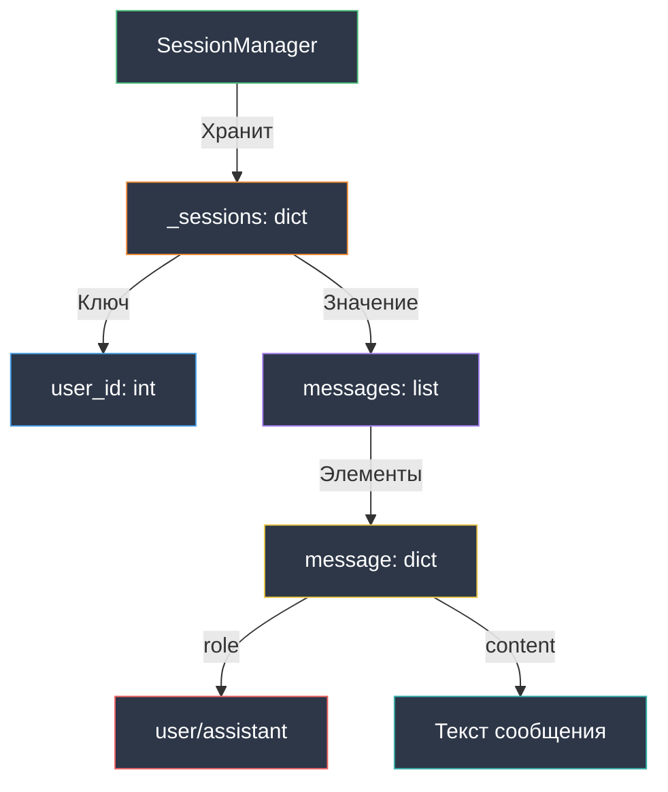

# Модель данных

Описание модели данных AI Dialogs Bot.

## Обзор

Для MVP используется хранение в памяти без базы данных. История диалогов теряется при перезапуске бота.

## SessionManager

Центральный компонент для управления сессиями пользователей.

```python
class SessionManager:
    def __init__(self):
        self._sessions: dict[int, list[dict]] = {}
```

### Структура данных



### Формат сообщения

```python
{
    "role": "user",        # или "assistant"
    "content": "Привет!"   # текст сообщения
}
```

**Роли:**
- `user` - сообщение от пользователя
- `assistant` - ответ бота

### Пример сессии

```python
_sessions = {
    123456: [
        {"role": "user", "content": "Привет"},
        {"role": "assistant", "content": "Здравствуй, смертный"},
        {"role": "user", "content": "Как дела?"},
        {"role": "assistant", "content": "Не твоё дело"}
    ],
    789012: [
        {"role": "user", "content": "Кто ты?"},
        {"role": "assistant", "content": "Я эльф"}
    ]
}
```

## Методы SessionManager

### get_session(user_id: int) -> list[dict]

Получает историю диалога для пользователя.

```python
session = session_manager.get_session(123456)
# Возвращает: [{"role": "user", "content": "..."}, ...]
```

**Поведение:**
- Если сессии нет → создает пустой список
- Возвращает ссылку на список (не копию)

### add_message(user_id: int, role: str, content: str) -> None

Добавляет сообщение в историю.

```python
session_manager.add_message(123456, "user", "Привет")
session_manager.add_message(123456, "assistant", "Здравствуй")
```

### clear_session(user_id: int) -> None

Очищает историю диалога для пользователя.

```python
session_manager.clear_session(123456)
# Сессия: 123456 -> []
```

## Поток работы с данными

```mermaid
sequenceDiagram
    participant B as TelegramBot
    participant SM as SessionManager
    participant M as _sessions dict

    Note over B: Получено сообщение от user_id=123

    B->>SM: add_message(123, "user", "Привет")
    SM->>SM: get_session(123)
    SM->>M: Создает [] если нет
    SM->>M: Добавляет {"role": "user", "content": "Привет"}

    B->>SM: get_session(123)
    SM->>M: Получает список сообщений
    M-->>SM: [{"role": "user", "content": "Привет"}]
    SM-->>B: История

    Note over B: Получен ответ от LLM

    B->>SM: add_message(123, "assistant", "Здравствуй")
    SM->>M: Добавляет {"role": "assistant", "content": "Здравствуй"}

    Note over B: Команда /reset

    B->>SM: clear_session(123)
    SM->>M: Устанавливает []

    style B fill:#2d3748,stroke:#48bb78,color:#ffffff
    style SM fill:#2d3748,stroke:#ed8936,color:#ffffff
    style M fill:#2d3748,stroke:#9f7aea,color:#ffffff
```

## Интеграция с LLM

История передается в `LLMClient.get_response()`:

```python
# SessionManager возвращает историю
messages = session_manager.get_session(user_id)
# [{"role": "user", "content": "..."}, ...]

# LLMClient добавляет system prompt в начало
full_messages = [
    {"role": "system", "content": system_prompt},
    {"role": "user", "content": "..."},
    {"role": "assistant", "content": "..."}
]

# Отправляется в OpenAI API
response = client.chat.completions.create(
    model=model,
    messages=full_messages
)
```

## Ограничения текущей реализации

### Хранение в памяти
- **Плюсы:** Простота, быстрота
- **Минусы:** История теряется при перезапуске

### Нет персистентности
- Нет базы данных
- Нет файлового хранения
- Подходит для MVP

### Нет лимитов
- История растет бесконечно
- Может привести к большим токенам в LLM
- Решается через `/reset`

### Потокобезопасность
- Однопоточное выполнение через asyncio
- Нет конкурентного доступа к `_sessions`

## Пример использования

```python
from session_manager import SessionManager

# Инициализация
sm = SessionManager()

# Первое сообщение пользователя
sm.add_message(123, "user", "Привет")
history = sm.get_session(123)
# [{"role": "user", "content": "Привет"}]

# Ответ ассистента
sm.add_message(123, "assistant", "Здравствуй")
history = sm.get_session(123)
# [
#   {"role": "user", "content": "Привет"},
#   {"role": "assistant", "content": "Здравствуй"}
# ]

# Очистка истории
sm.clear_session(123)
history = sm.get_session(123)
# []
```

## Типизация

Все методы типизированы:

```python
_sessions: dict[int, list[dict]]                    # Хранилище
get_session(user_id: int) -> list[dict]             # Получение
add_message(user_id: int, role: str, content: str)  # Добавление
clear_session(user_id: int) -> None                 # Очистка
```

## Следующие шаги

- [Интеграции](integrations.md) - работа с внешними API
- [Codebase Tour](codebase-tour.md) - детальный обзор кода
- [Тестирование](testing.md) - тесты SessionManager

