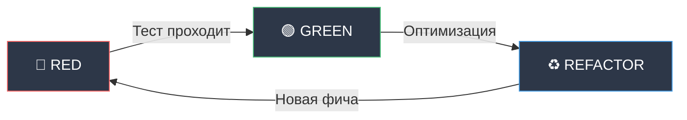

# Процессы разработки

Процесс разработки AI Dialogs Bot следует TDD подходу.

## TDD Workflow

Test-Driven Development с циклом RED-GREEN-REFACTOR.



### Фаза RED (Красная)

**Цель:** Написать падающий тест.

1. Определи новый функционал
2. Напиши тест который проверяет этот функционал
3. Запусти `make test`
4. Тест должен упасть (RED)

**Пример:**
```python
def test_add_message():
    sm = SessionManager()
    sm.add_message(123, "user", "Привет")
    assert sm.get_session(123)[0]["content"] == "Привет"
```

### Фаза GREEN (Зеленая)

**Цель:** Минимальная реализация для прохождения теста.

1. Реализуй код для прохождения теста
2. Запусти `make test`
3. Тест должен пройти (GREEN)
4. НЕ оптимизируй на этом этапе

**Пример:**
```python
def add_message(self, user_id: int, role: str, content: str):
    session = self.get_session(user_id)
    session.append({"role": role, "content": content})
```

### Фаза REFACTOR (Рефакторинг)

**Цель:** Улучшение кода при зеленых тестах.

1. Оптимизируй реализацию
2. Запусти `make test` - тесты остаются зелеными
3. Запусти инструменты качества:
   - `make format`
   - `make lint`
   - `make typecheck`

## Команды разработки

### Основные команды

```bash
# Запуск бота
make run

# Тесты
make test

# Покрытие
make coverage

# Форматирование
make format

# Линтер
make lint

# Проверка типов
make typecheck

# Очистка временных файлов
make clean
```

### Полная проверка

```bash
# Перед коммитом
make format && make lint && make typecheck && make test
```

## Инструменты качества

### Ruff (форматтер + линтер)

**Форматирование:**
```bash
make format
# uv run ruff format src/ tests/
```

**Проверка стиля:**
```bash
make lint
# uv run ruff check src/ tests/
```

**Настройки (pyproject.toml):**
```toml
[tool.ruff]
line-length = 100
target-version = "py311"

[tool.ruff.lint]
select = ["E", "F", "I", "N", "W", "B"]
ignore = ["N802", "N803"]
```

### Mypy (проверка типов)

```bash
make typecheck
# uv run mypy src/
```

**Настройки (pyproject.toml):**
```toml
[tool.mypy]
python_version = "3.11"
warn_return_any = true
warn_unused_configs = true
disallow_untyped_defs = false
```

### Pytest (тесты)

```bash
# Все тесты
make test

# С покрытием
make coverage

# Конкретный файл
uv run pytest tests/test_bot.py -v

# Конкретный тест
uv run pytest tests/test_bot.py::test_start_command -v
```

## Стандарты кода

### Типизация

**Везде используй type hints:**
```python
def get_response(self, messages: list[dict]) -> str:
    ...

def add_message(self, user_id: int, role: str, content: str) -> None:
    ...
```

**Современный синтаксис Python 3.11+:**
```python
# ✅ Хорошо
list[dict]
dict[int, str]

# ❌ Старый стиль
List[Dict]
Dict[int, str]
```

### Именование

**Классы:** `PascalCase`
```python
class TelegramBot:
class SessionManager:
```

**Функции/методы:** `snake_case`
```python
def get_response():
def add_message():
```

**Приватные методы:** `_private`
```python
def _start_handler():
def _read_prompt_file():
```

**Константы:** `UPPER_SNAKE_CASE` (редко)
```python
MAX_HISTORY_LENGTH = 100
```

### Структура кода

**1 класс = 1 файл:**
```python
# bot.py - только TelegramBot
# llm_client.py - только LLMClient
# session_manager.py - только SessionManager
```

**Без docstrings:**
Код должен быть самодокументируемым.

```python
# ❌ Избыточно
def get_session(self, user_id: int) -> list[dict]:
    """
    Получает сессию пользователя.
    
    Args:
        user_id: ID пользователя
        
    Returns:
        Список сообщений
    """
    ...

# ✅ Достаточно
def get_session(self, user_id: int) -> list[dict]:
    if user_id not in self._sessions:
        self._sessions[user_id] = []
    return self._sessions[user_id]
```

### Обработка ошибок

**Логируй с контекстом:**
```python
logger.error(f"Ошибка LLM API для пользователя {user_id}: {e}")
```

**Не глотай исключения:**
```python
# ❌ Плохо
try:
    result = operation()
except:
    pass

# ✅ Хорошо
try:
    result = operation()
except Exception as e:
    logger.error(f"Ошибка: {e}")
    raise
```

**Понятные сообщения пользователю:**
```python
await message.answer("Извините, произошла ошибка. Попробуйте позже.")
```

## Git Workflow

### Коммиты

**Формат:**
- Глагол в третьем лице: добавлено, исправлено, реализовано
- Максимум 80 символов
- Без точки в конце

**Примеры:**
```bash
# ✅ Хорошо
git commit -m "Реализовано Config и структуру проекта"
git commit -m "Добавлено LLMClient с поддержкой OpenAI API"
git commit -m "Исправлено обработку ошибок в bot.py"

# ❌ Плохо
git commit -m "fix"
git commit -m "Updated files."
git commit -m "Работа с конфигом"
```

### Перед коммитом

**Обязательная проверка:**
```bash
# 1. Форматирование
make format

# 2. Линтер (исправь все ошибки)
make lint

# 3. Типы
make typecheck

# 4. Тесты (все зеленые)
make test

# 5. Покрытие (>80%)
make coverage
```

### Workflow

```bash
# 1. Создай ветку (если используются)
git checkout -b feature/new-command

# 2. Реализуй (TDD цикл)
# RED -> GREEN -> REFACTOR

# 3. Проверка качества
make format && make lint && make typecheck && make test

# 4. Коммит
git add .
git commit -m "Добавлено команду /help"

# 5. Push
git push origin feature/new-command
```

## Принципы разработки

### KISS (Keep It Simple, Stupid)

Максимальная простота, без избыточных абстракций.

```python
# ✅ Просто
def clear_session(self, user_id: int):
    self._sessions[user_id] = []

# ❌ Избыточно
def clear_session(self, user_id: int):
    strategy = ClearStrategyFactory.create("reset")
    strategy.execute(self._sessions, user_id)
```

### MVP подход

Только необходимый функционал.

```python
# ✅ MVP
# Хранение в памяти, достаточно для старта

# ❌ Оверинжиниринг
# БД, кэширование, репликация для первой версии
```

### DRY (Don't Repeat Yourself)

Не дублируй код.

```python
# ✅ DRY
def _check_user(self, message: Message) -> int | None:
    if not message.from_user:
        return None
    return message.from_user.id

# Используется везде
user_id = self._check_user(message)
if user_id is None:
    return
```

### SOLID

**Single Responsibility:**
- `Config` - только конфигурация
- `SessionManager` - только сессии
- `LLMClient` - только LLM
- `TelegramBot` - только Telegram события

**Dependency Inversion:**
- Зависимости через конструктор
- Простая подмена в тестах

## Логирование

```python
import logging

logger = logging.getLogger(__name__)

# Информация
logger.info("Бот запущен")
logger.info(f"Команда /start от пользователя {user_id}")

# Ошибки с контекстом
logger.error(f"Ошибка LLM API для пользователя {user_id}: {e}")
```

**Логируй:**
- Старт/стоп приложения
- Входящие команды и сообщения
- Вызовы внешних API
- Ошибки с контекстом

**НЕ логируй:**
- Чувствительные данные (токены, пароли)
- Избыточную информацию (каждое присваивание)

## Добавление новой фичи

### Пример: команда /help

**1. RED - Напиши тест:**
```python
@pytest.mark.asyncio
async def test_help_command(bot):
    message = MagicMock()
    message.from_user.id = 123
    message.answer = AsyncMock()
    
    await bot._help_handler(message)
    
    message.answer.assert_called_once()
    assert "Доступные команды" in message.answer.call_args[0][0]
```

**2. Запусти тест (должен упасть):**
```bash
make test  # ❌ AttributeError: '_help_handler' не существует
```

**3. GREEN - Реализуй минимум:**
```python
# bot.py
def _register_handlers(self):
    # ...
    self.dp.message.register(self._help_handler, Command("help"))

async def _help_handler(self, message: Message):
    if not message.from_user:
        return
    await message.answer(
        "Доступные команды:\n"
        "/start - Начать диалог\n"
        "/reset - Очистить историю\n"
        "/role - Показать роль\n"
        "/help - Эта справка"
    )
```

**4. Запусти тест (должен пройти):**
```bash
make test  # ✅ PASSED
```

**5. REFACTOR - Улучши:**
```bash
make format
make lint
make typecheck
make test  # Все зеленые
```

**6. Коммит:**
```bash
git add .
git commit -m "Добавлено команду /help"
```

## Следующие шаги

- [Тестирование](testing.md) - написание тестов
- [Deployment](deployment.md) - подготовка к продакшену
- [Troubleshooting](troubleshooting.md) - решение проблем

