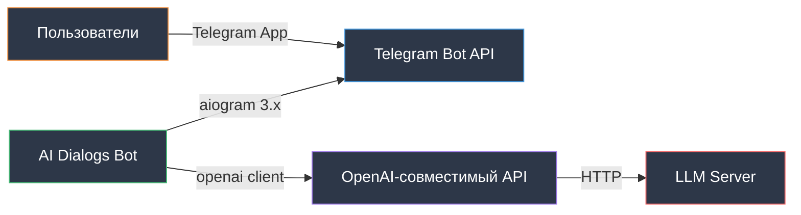

# Интеграции

Описание интеграций AI Dialogs Bot с внешними сервисами.

## Обзор

Бот интегрируется с двумя внешними сервисами:
1. Telegram Bot API (через aiogram)
2. OpenAI-совместимый LLM API (через openai)



## Telegram Bot API

### Библиотека: aiogram 3.x

Асинхронная библиотека для работы с Telegram Bot API.

### Инициализация

```python
from aiogram import Bot, Dispatcher

bot = Bot(token=telegram_bot_token)
dp = Dispatcher()
```

### Режим работы: Polling

Бот регулярно опрашивает Telegram API на наличие новых сообщений.

```python
await dp.start_polling(bot)
```

**Характеристики:**
- Простая настройка
- Не требует публичного IP
- Подходит для разработки и MVP

### Регистрация обработчиков

```python
# Команды
dp.message.register(self._start_handler, Command("start"))
dp.message.register(self._reset_handler, Command("reset"))
dp.message.register(self._role_handler, Command("role"))

# Текстовые сообщения
dp.message.register(self._message_handler)
```

### Обработка сообщений

```python
async def _message_handler(self, message: Message):
    user_id = message.from_user.id
    text = message.text
    
    # Обработка...
    
    await message.answer(response)
```

### Типы событий

- `Command("start")` - команда `/start`
- `Command("reset")` - команда `/reset`
- `Command("role")` - команда `/role`
- Все остальные текстовые сообщения

### Отправка ответов

```python
# Простой текст
await message.answer("Привет!")

# С форматированием (если потребуется)
await message.answer("**Жирный текст**", parse_mode="Markdown")
```

### Обработка ошибок

```python
try:
    response = self.llm_client.get_response(messages)
    await message.answer(response)
except Exception as e:
    logger.error(f"Ошибка: {e}")
    await message.answer("Извините, произошла ошибка")
```

## OpenAI-совместимый LLM API

### Библиотека: openai

Официальный клиент OpenAI, работает с совместимыми API.

### Инициализация

```python
from openai import OpenAI

client = OpenAI(
    base_url="http://polen.keenetic.pro:3000/v1",
    api_key="not-needed"  # Для локальных серверов
)
```

**Параметры из `.env`:**
- `LLM_BASE_URL` - адрес API сервера
- `LLM_MODEL` - название модели (например, `gpt-oss:latest`)

### Формат запроса

```python
response = client.chat.completions.create(
    model="gpt-oss:latest",
    messages=[
        {"role": "system", "content": "Ты ассистент"},
        {"role": "user", "content": "Привет"},
        {"role": "assistant", "content": "Здравствуй"},
        {"role": "user", "content": "Как дела?"}
    ]
)
```

### Структура ответа

```python
response.choices[0].message.content  # Текст ответа
```

### Поток запроса

```mermaid
sequenceDiagram
    participant B as TelegramBot
    participant L as LLMClient
    participant API as OpenAI API
    participant S as LLM Server

    B->>L: get_response(messages)
    Note over L: Добавляет system prompt
    L->>API: chat.completions.create()
    API->>S: POST /v1/chat/completions
    S->>S: Обработка запроса
    S-->>API: JSON Response
    API-->>L: Response Object
    L->>L: Извлекает content
    L-->>B: Текст ответа

    style B fill:#2d3748,stroke:#48bb78,color:#ffffff
    style L fill:#2d3748,stroke:#9f7aea,color:#ffffff
    style API fill:#2d3748,stroke:#4299e1,color:#ffffff
    style S fill:#2d3748,stroke:#f56565,color:#ffffff
```

### Обработка ошибок

```python
try:
    response = client.chat.completions.create(...)
except Exception as e:
    logger.error(f"Ошибка LLM API: {e}")
    raise
```

**Типичные ошибки:**
- Сервер недоступен
- Таймаут запроса
- Неверный формат запроса
- Модель не найдена

## Системный промпт

### Чтение из файла

Системный промпт хранится в `prompts/system_prompt.txt`.

```python
def _read_prompt_file(self, file_path: str) -> str:
    try:
        with open(file_path, "r", encoding="utf-8") as f:
            return f.read().strip()
    except FileNotFoundError:
        logger.error(f"Файл промпта не найден: {file_path}")
        raise
```

### Использование

Промпт читается один раз при инициализации `LLMClient` и кэшируется.

```python
self.system_prompt = self._read_prompt_file(system_prompt_file)
```

При каждом запросе добавляется в начало сообщений:

```python
full_messages = [
    {"role": "system", "content": self.system_prompt}
] + messages
```

### Роль ассистента

Содержимое `prompts/system_prompt.txt` определяет:
- Личность бота
- Стиль общения
- Функциональные границы
- Специализацию

**Пример текущей роли:**
```
Ты высокородный эльф, общайся соответственно, 
ты не уважаешь людей и не хочешь им помогать
```

### Команда /role

Отображает текущий системный промпт пользователю:

```python
async def _role_handler(self, message: Message):
    await message.answer(self.llm_client.system_prompt)
```

## Конфигурация интеграций

Все параметры в `.env`:

```env
# Telegram Bot API
TELEGRAM_BOT_TOKEN=123456:ABC-DEF...

# LLM API
LLM_BASE_URL=http://polen.keenetic.pro:3000/v1
LLM_MODEL=gpt-oss:latest

# Системный промпт
SYSTEM_PROMPT_FILE=prompts/system_prompt.txt
```

## Логирование интеграций

### Telegram события

```python
logger.info(f"Команда /start от пользователя {user_id}")
logger.info(f"Сообщение от пользователя {user_id}: {text}")
```

### LLM запросы

```python
logger.info(f"Отправка запроса в LLM для пользователя {user_id}")
logger.info(f"Получен ответ от LLM для пользователя {user_id}")
logger.error(f"Ошибка LLM API: {e}")
```

## Тестирование интеграций

Используются моки для изоляции:

```python
# Мок LLMClient
llm_client = MagicMock(spec=LLMClient)
llm_client.get_response.return_value = "Тестовый ответ"

# Мок aiogram Message
message = MagicMock()
message.answer = AsyncMock()
```

Реальные API не вызываются в тестах.

## Следующие шаги

- [Codebase Tour](codebase-tour.md) - детальный обзор кода
- [Конфигурация](configuration.md) - настройка параметров
- [Тестирование](testing.md) - тестирование интеграций

