# Визуализация проекта

Диаграммы AI Dialogs Bot с разных точек зрения.

## Обзор системы

### High-Level архитектура

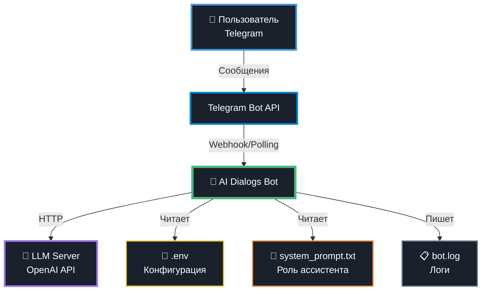

---

## Архитектура компонентов

### Модульная структура

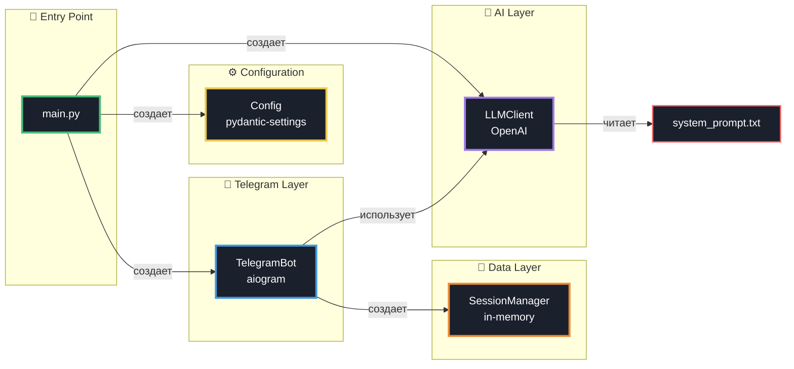

### Зависимости между классами

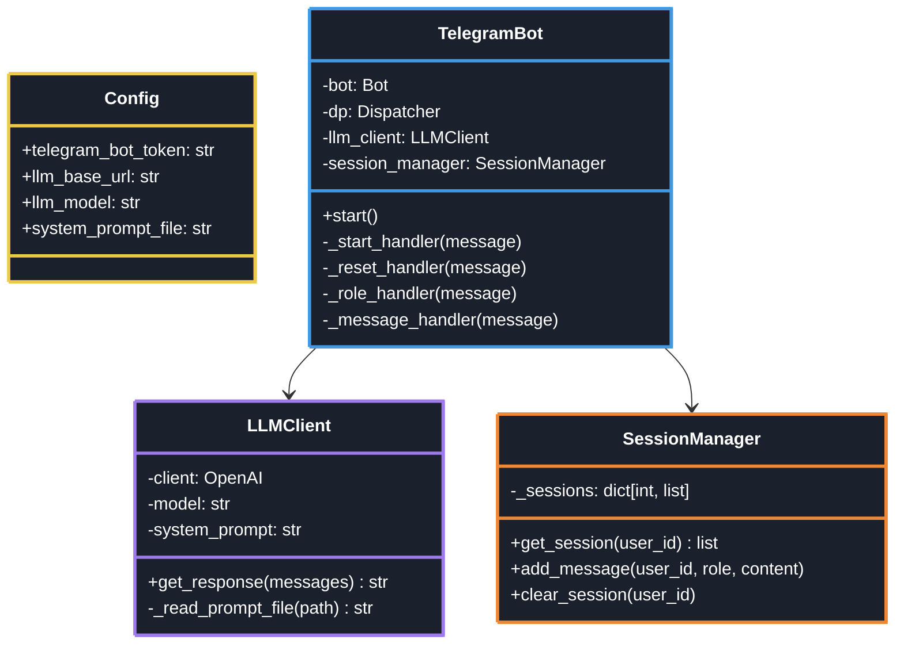

---

## Потоки данных

### Поток обработки сообщения

```mermaid
sequenceDiagram
    autonumber
    participant U as 👤 Пользователь
    participant T as 📱 Telegram API
    participant B as 🤖 TelegramBot
    participant S as 💾 SessionManager
    participant L as 🧠 LLMClient
    participant A as ☁️ OpenAI API

    U->>T: Отправляет "Привет"
    T->>B: Message event
    
    rect rgb(45, 55, 72)
        Note over B: Обработка входящего сообщения
        B->>B: Логирует сообщение
        B->>S: add_message(123, "user", "Привет")
        S->>S: Сохраняет в _sessions[123]
    end
    
    rect rgb(45, 55, 72)
        Note over B,S: Получение истории
        B->>S: get_session(123)
        S-->>B: [{"role": "user", "content": "Привет"}]
    end
    
    rect rgb(45, 55, 72)
        Note over B,A: Запрос к LLM
        B->>L: get_response(messages)
        L->>L: Добавляет system_prompt
        L->>A: POST /chat/completions
        A-->>L: Response JSON
        L->>L: Извлекает content
        L-->>B: "Здравствуй, смертный"
    end
    
    rect rgb(45, 55, 72)
        Note over B,S: Сохранение ответа
        B->>S: add_message(123, "assistant", "Здравствуй...")
        S->>S: Добавляет в _sessions[123]
    end
    
    B->>T: send_message("Здравствуй...")
    T->>U: Показывает ответ
    
    style U fill:#1a202c,stroke:#4299e1,stroke-width:3px,color:#ffffff
    style T fill:#1a202c,stroke:#0088cc,stroke-width:3px,color:#ffffff
    style B fill:#1a202c,stroke:#48bb78,stroke-width:3px,color:#ffffff
    style S fill:#1a202c,stroke:#ed8936,stroke-width:3px,color:#ffffff
    style L fill:#1a202c,stroke:#9f7aea,stroke-width:3px,color:#ffffff
    style A fill:#1a202c,stroke:#805ad5,stroke-width:3px,color:#ffffff
```

### Обработка команды /start

```mermaid
sequenceDiagram
    participant U as 👤 Пользователь
    participant B as 🤖 Bot
    participant S as 💾 SessionManager
    participant L as 📋 Logger

    U->>B: /start
    B->>L: INFO: Команда /start от user_id=123
    B->>S: clear_session(123)
    S->>S: _sessions[123] = []
    B->>U: "Привет! Я AI-ассистент..."
    
    style U fill:#1a202c,stroke:#4299e1,stroke-width:3px,color:#ffffff
    style B fill:#1a202c,stroke:#48bb78,stroke-width:3px,color:#ffffff
    style S fill:#1a202c,stroke:#ed8936,stroke-width:3px,color:#ffffff
    style L fill:#1a202c,stroke:#718096,stroke-width:3px,color:#ffffff
```

### Обработка команды /role

```mermaid
sequenceDiagram
    participant U as 👤 Пользователь
    participant B as 🤖 Bot
    participant L as 🧠 LLMClient
    participant F as 📝 system_prompt.txt

    U->>B: /role
    B->>L: Запрашивает system_prompt
    Note over L: Промпт уже в памяти<br/>(кэш из __init__)
    L-->>B: "Ты высокородный эльф..."
    B->>U: Отправляет промпт
    
    Note over F: Файл читается<br/>только при старте
    
    style U fill:#1a202c,stroke:#4299e1,stroke-width:3px,color:#ffffff
    style B fill:#1a202c,stroke:#48bb78,stroke-width:3px,color:#ffffff
    style L fill:#1a202c,stroke:#9f7aea,stroke-width:3px,color:#ffffff
    style F fill:#1a202c,stroke:#ed8936,stroke-width:3px,color:#ffffff
```

---

## Модель данных

### Структура SessionManager

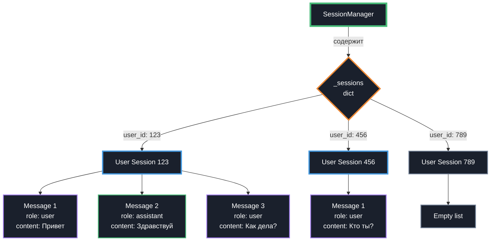

### Формат сообщения в LLM API

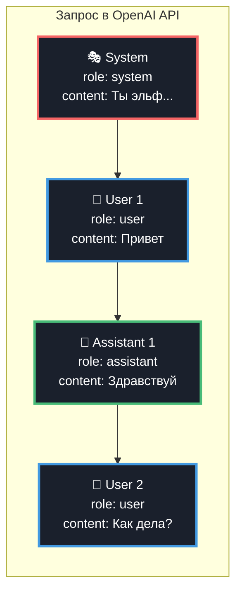

---

## Жизненный цикл

### Инициализация приложения

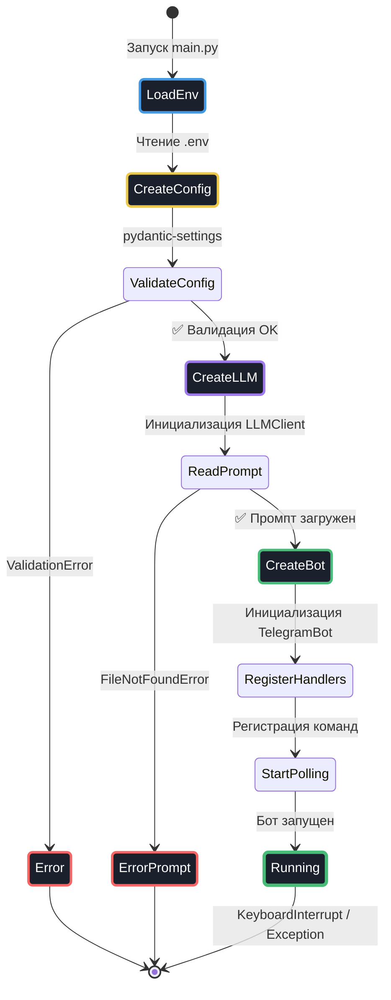

### Состояния сессии пользователя

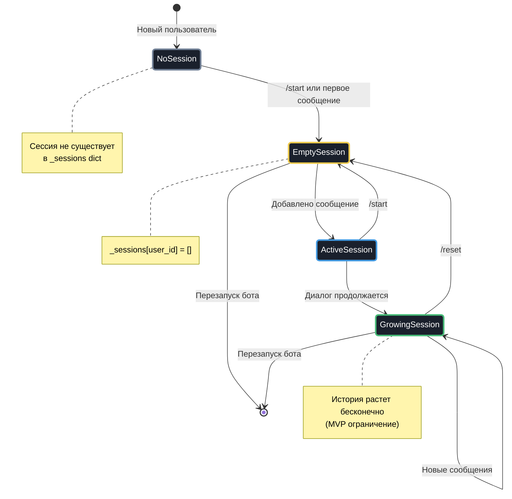

---

## TDD Workflow

### Цикл разработки

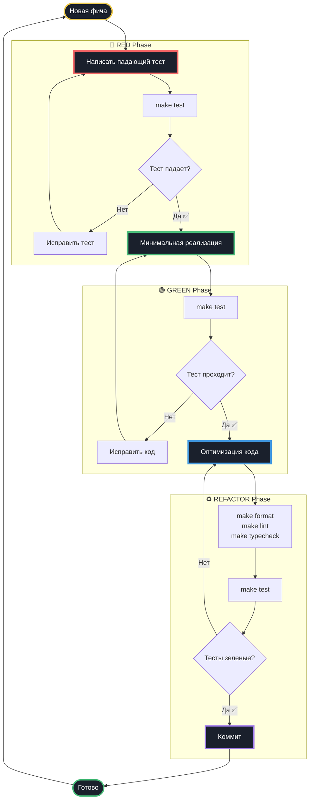

### Процесс коммита

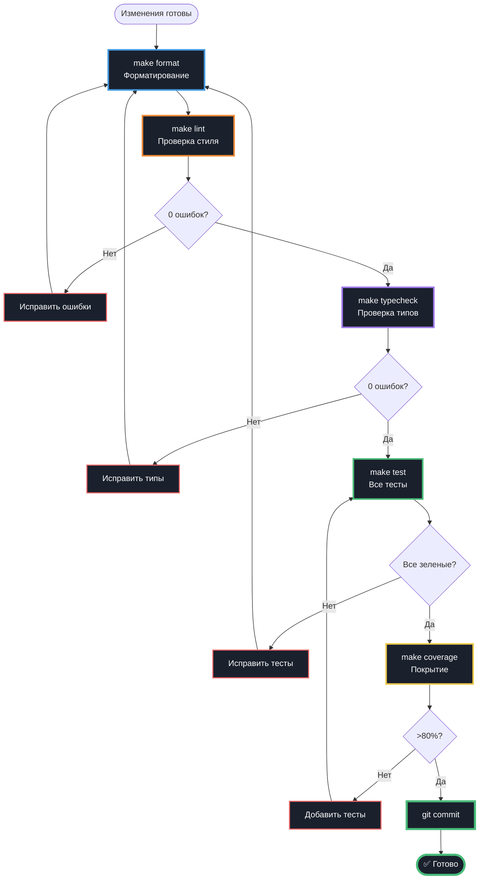

---

## Deployment

### Окружения

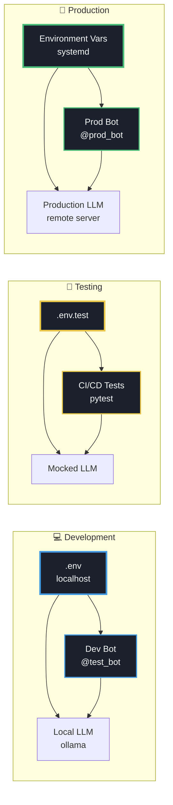

### Мониторинг и логирование

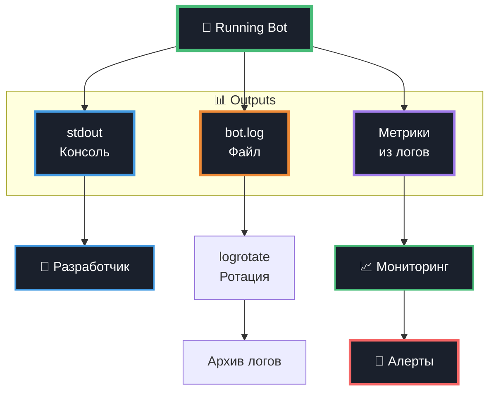

---

## Обработка ошибок

### Поток обработки исключений

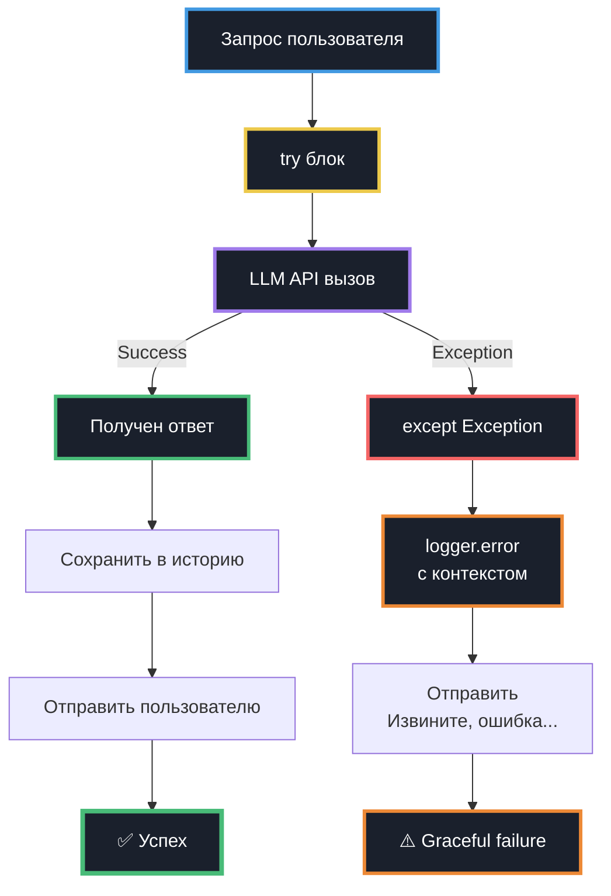

---

## Структура файлов

### Дерево проекта

```mermaid
graph TD
    Root[📁 aidialogs/] --> Src[📁 src/]
    Root --> Tests[📁 tests/]
    Root --> Docs[📁 docs/]
    Root --> Prompts[📁 prompts/]
    Root --> Files[📄 Конфиг файлы]
    
    Src --> Main[main.py<br/>Точка входа]
    Src --> Config[config.py<br/>Config класс]
    Src --> Bot[bot.py<br/>TelegramBot]
    Src --> LLM[llm_client.py<br/>LLMClient]
    Src --> SM[session_manager.py<br/>SessionManager]
    
    Tests --> TConfig[test_config.py]
    Tests --> TBot[test_bot.py]
    Tests --> TLLM[test_llm_client.py]
    Tests --> TSM[test_session_manager.py]
    Tests --> TInt[test_integration.py]
    
    Docs --> Guides[📁 guides/<br/>Гайды]
    Docs --> Vision[vision.md]
    Docs --> Task[tasklist.md]
    
    Prompts --> Prompt[system_prompt.txt<br/>Роль ассистента]
    
    Files --> Make[Makefile<br/>Команды]
    Files --> Pyproject[pyproject.toml<br/>Зависимости]
    Files --> Pytest[pytest.ini<br/>Настройки]
    Files --> Env[.env<br/>Секреты]
    
    style Root fill:#1a202c,stroke:#48bb78,stroke-width:4px,color:#ffffff
    style Src fill:#1a202c,stroke:#4299e1,stroke-width:3px,color:#ffffff
    style Tests fill:#1a202c,stroke:#48bb78,stroke-width:3px,color:#ffffff
    style Docs fill:#1a202c,stroke:#ed8936,stroke-width:3px,color:#ffffff
    style Prompts fill:#1a202c,stroke:#9f7aea,stroke-width:3px,color:#ffffff
    style Main fill:#1a202c,stroke:#f56565,stroke-width:2px,color:#ffffff
    style Config fill:#1a202c,stroke:#ecc94b,stroke-width:2px,color:#ffffff
    style Bot fill:#1a202c,stroke:#4299e1,stroke-width:2px,color:#ffffff
    style LLM fill:#1a202c,stroke:#9f7aea,stroke-width:2px,color:#ffffff
    style SM fill:#1a202c,stroke:#ed8936,stroke-width:2px,color:#ffffff
```

---

## Покрытие тестами

### Распределение по модулям

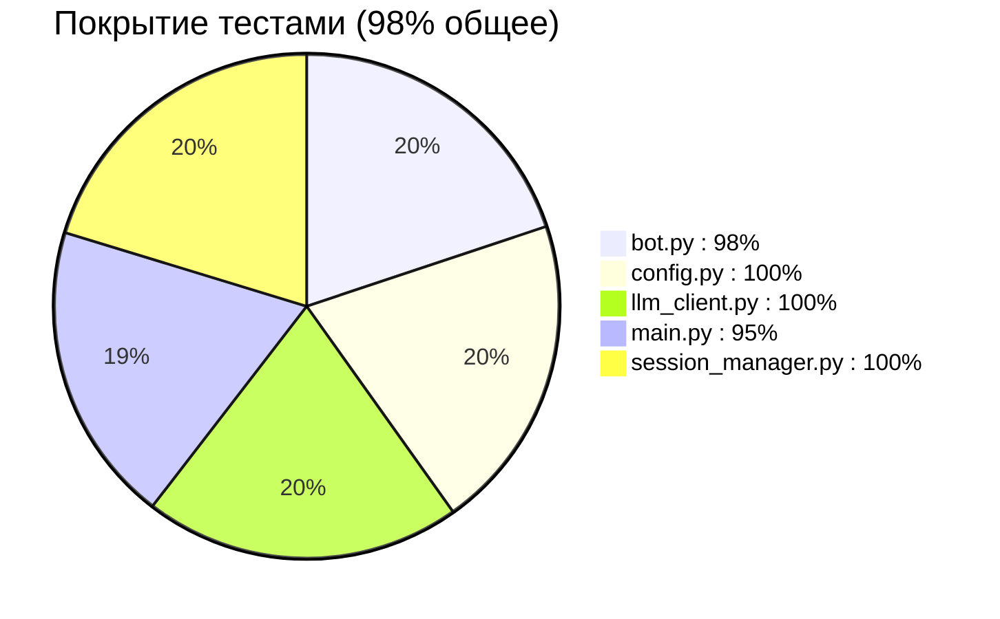

### Типы тестов

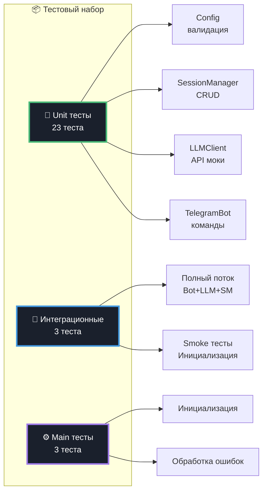

---

## Временная шкала проекта

### Завершенные итерации

```mermaid
gantt
    title Прогресс разработки AI Dialogs Bot
    dateFormat YYYY-MM-DD
    
    section MVP
    Итерация 1: Эхо-бот           :done, i1, 2025-10-10, 1d
    Итерация 2: LLMClient          :done, i2, 2025-10-10, 1d
    Итерация 3: LLM + История      :done, i3, 2025-10-10, 1d
    Итерация 4: Команда /reset     :done, i4, 2025-10-10, 1d
    Итерация 5: Логирование        :done, i5, 2025-10-10, 1d
    Итерация 6: Команда /role      :done, i6, 2025-10-11, 1d
    
    section Documentation
    Создание гайдов               :done, d1, 2025-10-16, 1d
```

---

## Принципы разработки

### SOLID в проекте

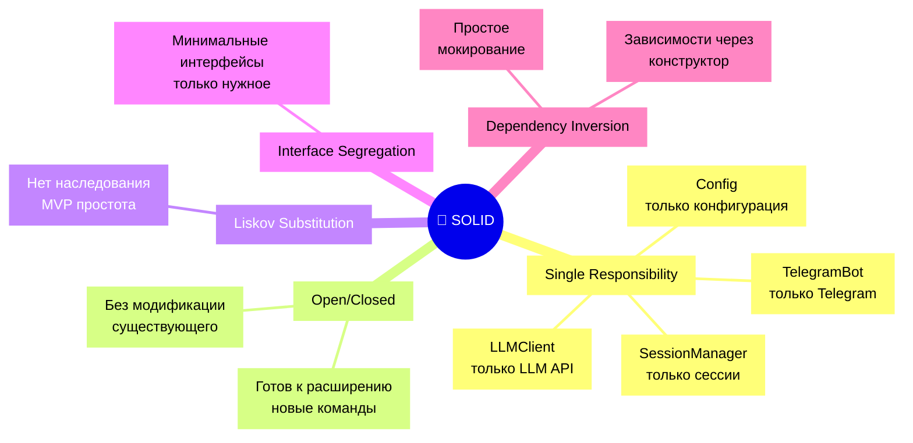

### Архитектурные принципы

```mermaid
mindmap
    root((⚡ Принципы))
        KISS[KISS]
            Простота[Максимальная<br/>простота]
            No_patterns[Без избыточных<br/>паттернов]
            Direct[Прямой код]
        
        MVP[MVP]
            Minimal[Минимальный<br/>функционал]
            No_db[Без БД<br/>для старта]
            Memory[В памяти]
        
        TDD[TDD]
            Red[🔴 RED фаза]
            Green[🟢 GREEN фаза]
            Refactor[♻️ REFACTOR фаза]
        
        Quality[Качество]
            Tests[98% покрытие]
            Types[Типизация везде]
            Lint[0 ошибок линтера]
```


